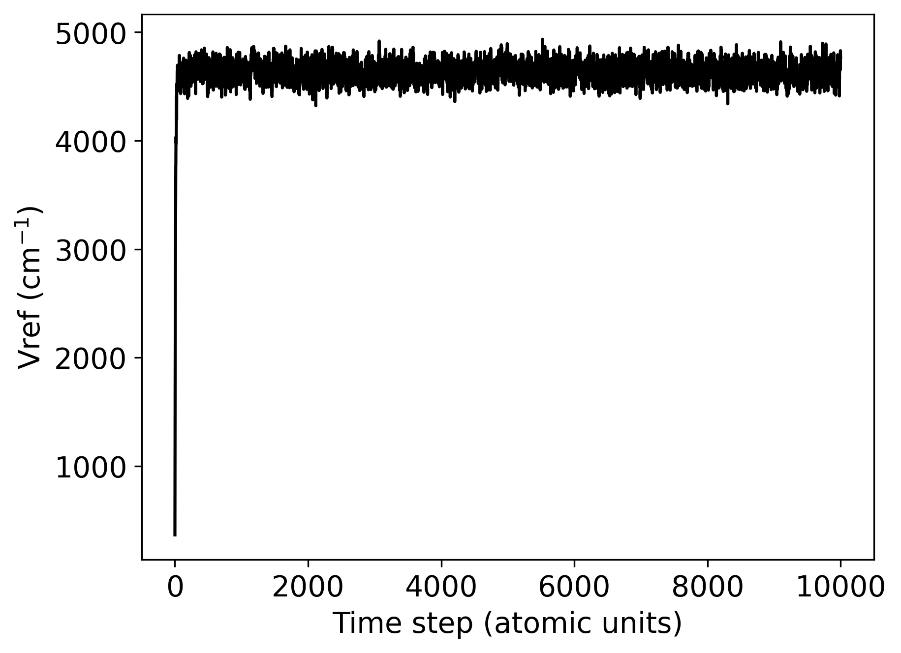
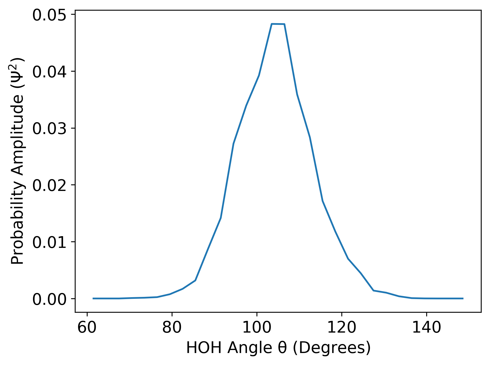
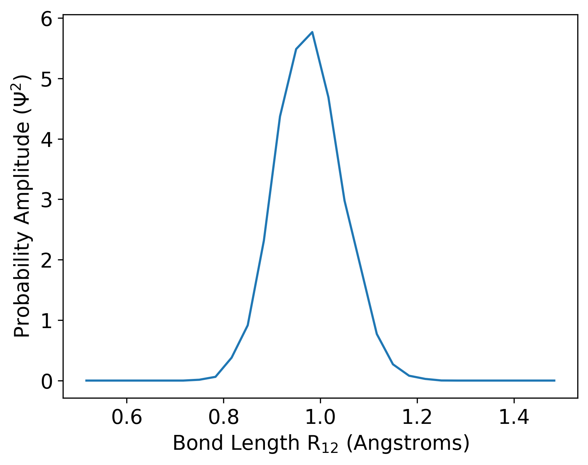

Analyzing DMC Results: Energies and Wave functions
=========================================================

``PyVibDMC`` offers a robust suite of tools for analyzing the output from running one or multiple
DMC simulations.

For a quick explanation of how this code calculates probabilities from the wave function,
please see the `McCoy group's tutorial on Descendant Weighting and Wave function Analysis <https://mccoygroup.github.io/References/References/Monte%20Carlo%20Methods/DWandWfns.html>`_.

Sample Data
-------------------------------------------------------
In the ``PyVibDMC`` package, one will find sample data for the purpose of this example. The data are the results of 5 DMC
simulations run on a water monomer. The potential energy surface for these calculations is prepackaged with
``PyVibDMC``: the Partridge/Schwenke potential. The resultant files from a single DMC simulation are:

- A ``{sim_name}_sim_info.hdf5`` file, which houses arrays that have the value of Vref at each time step, as well as the population\
  (for discrete weighting DMC) or continuous weights (for continuous weighting) at each time step. This file also includes a list of\
  integers that correspond to the atomic numbers of the molecular system used in the simulation, so for a water monomer this will be\
  [1,1,8] for [H,H,O].

- A ``{sim_name}.log`` file, which details certain information about the simulation. The verbosity of this log file is
  controlled by the ``log_every`` parameter.

- Many ``wfns/{sim_name}_wfn_{current_time_step}ts.hdf5`` files, which collect a snapshot of the ensemble (the wave function)\
  at the user specified time steps (from ``wfn_every``), and also its corresponding descendant weights.  Typically, these wave functions and\
  descendant weights are combined into one, larger wave function to improve on statistical uncertainty in the wave function.

- Many ``chkpts/{sim_name}_{current_time_step}.pickle`` files, which is the simulation checkpointing itself every x\
  time steps specified by the user in ``chkpt_every``.

All of these files will output in the user-specified ``output_folder``. For the purposes of this overview, we will be
using the prepackaged simulation data that comes with ``PyVibDMC``.  For the sample data, each ``sim_name`` is
``tutorial_water_{i}``, where ``i`` is an integer between 0 and 4, and the ``output_folder`` is ``sample_sim_data`` for
all 5 simulations.

**Analysis Note: PyVibDMC takes in coordinates and potential energy values in atomic units.  However, it returns geometries in Angstroms!**
**Coding Note: We recommend that you specify simulation output to go outside the PyVibDMC package.**

This is purely for demonstration purposes.

Analyzing the zero-point energy for a DMC simulation
-------------------------------------------------------
One of the best indicators for convergence of a DMC simulation is the calculation of zero-point energy. In order to calculate
this metric, one must average ``Vref`` over a certain amount of the simulation time, as the value fluctuates about the actual
zero-point energy as the simulation moves forward.

Plotting Vref::

    from pyvibdmc.analysis import * #this imports AnalyzeWfn, SimInfo, and Plotter
    tutorial_sim = SimInfo('pyvibdmc/pyvibdmc/sample_sim_data/tutorial_water_0_sim_info.hdf5')
    Plotter.plt_vref_vs_tau(vref_vs_tau=tutorial_sim.get_vref(),
	                    save_name=f'test_vref.png')

   A plot of Vref for tutorial_water_0 as the simulation progresses.  We will average over a certain portion of this to calculate the ZPE.

To calculate the zero-point energy based on a single DMC simulation, one would do::

   time_step_onwards = 2000
   tutorial_sim = SimInfo('pyvibdmc/pyvibdmc/sample_sim_data/tutorial_water_0_sim_info.hdf5')
   zpe = tutorial_sim.get_zpe(onwards=time_step_onwards)

The ``onwards`` argument to ``get_zpe`` is specifying at which time step should I begin averaging ``Vref``.  The ``PyVibDMC`` code
will then calculate the average from ``onwards`` until the end of the simulation.  There is no one good number for this.
If you examine ``Vref`` as a function of the time step, you will see that the simulation converges relatively quickly.
As such, it is our recommendation that you use the last 4/5ths of the simulation for averaging ``Vref``. It is also
worth exploring how ``zpe`` changes if you choose different values.

Analyzing the zero-point energy for across DMC simulations
-----------------------------------------------------------
Due to the stochastic nature of DMC, it is generally not recommended to only run a single DMC simulation
on a molecular system of interest.  As such, it is generally best practice to run 3-5 DMC simulations, and compare
the zero-point energies and wave functions calculated from each of those simulations. That way, one can calculate an average zpe and
also report uncertainties from the average across the simulations.

This is how one would compare across DMC simulations using ``PyVibDMC``::

    zpes = []
    for sim_num in range(5):
        tutorial_sim = SimInfo(f'pyvibdmc/sample_sim_data/tutorial_water_{sim_num}_sim_info.hdf5')  # 5 DMC sims!
        this_zpe = tutorial_sim.get_zpe(onwards=2000)
        zpes.append(this_zpe)
    final_zpe = np.average(zpes)
    final_std_dev = np.std(zpes)

So, we are *averaging the average Vref* across 5 different DMC simulations.

Analyzing the Ground State Wave function from a DMC simulation
---------------------------------------------------------------
Each DMC simulation should output multiple snapshots of the ensemble of walkers after some equilibration time.  The
number of wave functions will be dependent on the ``wfn_every`` argument, the ``num_timesteps`` argument,
the ``equil_steps`` argument, and the ``desc_steps`` argument. ``PyVibDMC`` will start collecting wave functions after
``equil_steps`` time steps, every ``wfn_every`` time steps.  Descendant weighting will happen for ``desc_wt_steps`` time
steps, and this will all repeat until ``num_timesteps`` is reached.

In the simulation data, a wave function was collected every 1000 time steps, but not until the 500th time step. This
repeated until 10000 time steps are over.

Here is how to combine the various snapshots (2500 to 9500), and their descendant weights, into size NxMx3 and N arrays,
respectively, taken from a single DMC simulation::

   import numpy as np
   tutorial_sim = SimInfo('pyvibdmc/pyvibdmc/sample_sim_data/tutorial_water_0_sim_info.hdf5')
   # combined_wfns, dws = tutorial_sim.get_wfns([2500,3500,4500,5500,6500,7500,8500,9500]) # perfectly valid, but tiresome
   increment = 1000
   combined_wfns, dws = tutorial_sim.get_wfns(np.arange(2500,9500+increment,increment)) # for those familiar with numpy

Projecting the Probability Density onto a desirable coordinate
-----------------------------------------------------------------
With the wave function and descendant weights, we may then examine at the probability amplitude (:math:`\Psi^{2}`).
Since the wave function is a multidimensional ensemble of localized functions, however, we must integrate over all
other degrees of freedom and just examine one (or two)-dimensional projections. Say we wanted to examine what the
ground state probability amplitude looked like along the HOH bend in a water molecule.

Here is the code that will perform that projection, as well as plot it::

    from pyvibdmc.analysis import * # this imports AnalyzeWfn as well as Plotter
    import numpy as np

    tutorial_sim = SimInfo('pyvibdmc/pyvibdmc/sample_sim_data/tutorial_water_0_sim_info.hdf5')
    increment = 1000
    cds, dws = tutorial_sim.get_wfns(np.arange(2500,9500+increment,increment))
    savefigpth = '' # save in current directory

    analyzer = AnalyzeWfn(cds)  # initialize wavefunction analyzer object
    hoh_angle = analyzer.bond_angle(atm1=0,
                                    atm_vert=2,
                                    atm3=1)  # [H H O], so atm[2] at vertex

    hoh_angle = np.rad2deg(hoh_angle)  # analyzer returns in radians, convert to degrees for clarity

    hoh_histo = analyzer.projection_1d(attr=hoh_angle,  # make a 1d histogram , x/y data
                                       desc_weights=dws,
                                       bin_num=20,
                                       range=(60, 150))

    Plotter.plt_hist1d(hist=hoh_histo,  # plot histogram x/y data
                       xlabel=r"HOH Angle $\rm{\theta}$ (Degrees)",
                       save_name=f'{savefigpth}HOH_angle.png')

Here is the resultant plot of the HOH bend in water:

   The 1D DMC Projection of the probability amplitude onto the HOH bend in water.

Note that there is still noise in the distribution.  We can combine more wave functions to decrease the noise, or
even combine wave functions across simulations to do so.

There are many, many ways to interrogate a system.  We could have easily examined an OH stretch by doing
``bond_length = analyzer.bond_length(2,0)``.  The ``AnalyzeWfn`` class has a lot of functions that can be used to
examine the system, feel free to examine the ``PyVibDMC`` API for more information.

A way to get a good overview of a molecular system is by examining all atom-atom distances. Here is an example of how to
do that::

    import itertools as itt
    tutorial_sim = SimInfo('pyvibdmc/pyvibdmc/sample_sim_data/tutorial_water_0_sim_info.hdf5')
    increment = 1000
    cds, dws = tutorial_sim.get_wfns(np.arange(2500,9500+increment,increment))
    analyzer = AnalyzeWfn(cds)  # initialize analyzer object

    num_atoms = cds.shape[1] #remember, nxmx3 array, so this is m
    combos = itt.combinations(range(num_atoms), 2) #get all numbered pairs of atoms
    ranges = [(1.0,2.2), (0.5,1.5), (0.5,1.5)] #HH dist, OH dist 1, OH dist 2
    for combo_num, combo in enumerate(combos):  # for each pair of atom-atom distances, calculate the bond length for each walker
        cur_bl = analyzer.bond_length(combo[0], combo[1])

        bl_histo = analyzer.projection_1d(attr=cur_bl,  # make a 1d histogram , x/y data
                                      desc_weights=dws,
                                      bin_num=30,
                                      range=ranges[combo_num])

        Plotter.plt_hist1d(hist=bl_histo,  # plot histogram x/y data
                       xlabel=rf"Bond Length $\rm{{R_{{{combo[0]}{combo[1]}}}}}$ (Angstroms)",
                       save_name=f'BondLength_R{combo[0]}{combo[1]}.png')

Which leads to three plots that look like this:

   The 1D DMC Projection of the probability amplitude onto one of the three atom-atom distances in water. This one is an OH distance.

To see more examples of DMC wave function analysis, including more advanced ones, please check out the
`tests/test_analysis.py <https://github.com/rjdirisio/PyVibDMC/blob/master/PyVibDMC/tests/tutorial_analysis.py>`_ file in
the ``PyVibDMC`` repository on Github.